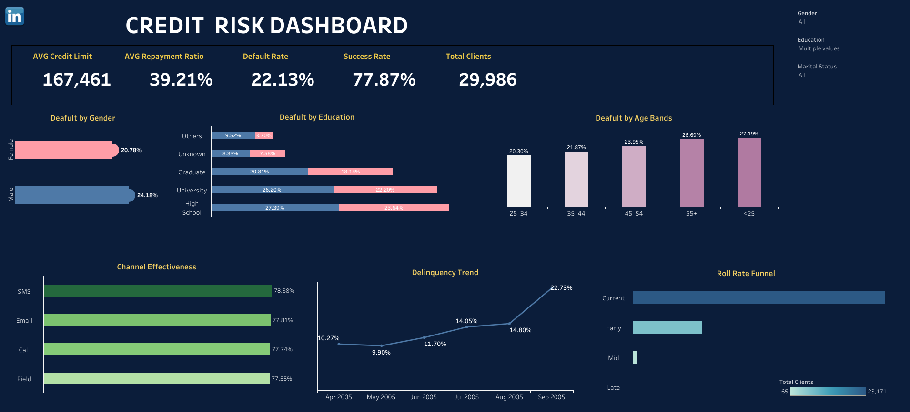

# 📊 Credit Risk Dashboard Project

An end-to-end project analyzing **Credit Card Default Risk** using **Python for data preparation** and **Tableau for dashboard visualization**.

---

---

## 🚀 Project Overview
The goal of this project is to explore **credit risk behavior** and design an interactive dashboard for stakeholders (collections team, risk managers) to monitor key metrics such as **default rate, repayment ratios, delinquency trends, and channel effectiveness**.

🔗 **Live Dashboard**: [View on Tableau Public](https://public.tableau.com/views/CreditRiskDashboard_17570712615800/CreditRiskDashboard?:language=en-US&:sid=&:redirect=auth&:display_count=n&:origin=viz_share_link)

---

## ⚙️ Tech Stack
- **Python**: pandas, numpy, matplotlib, seaborn  
- **Jupyter Notebooks**: cleaning.ipynb, exploratory.ipynb  
- **Tableau Public**: KPI cards, funnel charts, delinquency trends, demographic defaults  
- **Dataset**: [Default of Credit Card Clients Dataset](https://www.kaggle.com/datasets/uciml/default-of-credit-card-clients-dataset)

---

## 🔧 Workflow

### 1. Data Cleaning & Transformation (Python)
- Checked for missing values, data types, distributions  
- Mapped `PAY_0` → `Pay_Sep`, created **Delinquency Stage** field  
- Built **Repayment Ratio** and binned into repayment bands  
- Added simulated fields: `Collection_Channel`, `AB_Test_Group`  

### 2. Exploratory Data Analysis (Python)
- Default Rate overall (~22%)  
- Plots by **Gender, Age, Education**  
- Repayment Ratio distribution  
- Collection channel simulations (SMS, Email, Call, Field)  

### 2.1 Plots
Plots are stored in the [`reports/`](reports) folder:  

### 3. Visualization (Tableau)
- Built calculated measures for KPIs:
  - `Total Clients`
  - `Default Rate`
  - `Average Credit Limit`
  - `Average Repayment Ratio`
  - `Success Rate`
- Created visuals:
  - Default by Gender, Education, Age Bands
  - Delinquency Trend (line chart)
  - Roll Rate Funnel
  - Channel Effectiveness
- Added filters for Age Bands, Education, Gender, Marital Status  

---

## 🎨 UI/UX Improvements
- Dark theme with **cyber-style background**  
- Transparent KPI row  
- Gradient colors for Age Bands chart  
- Circle markers at bar ends (inspired by HR dashboards)  
- Clickable LinkedIn icon inside dashboard  

---

## 📊 Key Insights
1. **Default Rate**
   - Overall: **22.13%**
   - Males (24.18%) > Females (20.78%)

2. **Education Impact**
   - High School group: highest default (27.39%)  
   - Graduates/University still high (26–27%)

3. **Age Effect**
   - 25–34: lowest default (20.3%)  
   - 55+: highest default (26.7%)

4. **Delinquency Trend**
   - Increases monthly, peaking at **22.7%**

5. **Collection Channels (simulated)**
   - SMS: highest repayment success (78.4%)  
   - All channels close in performance

6. **Roll Rate Funnel**
   - Many clients remain Current  
   - Significant flow into Early & Mid delinquency

---

## 👩‍💻 Author

**Mikadataa**  
🔗 [LinkedIn](https://www.linkedin.com/in/smagulova/) | 🐙 [GitHub](https://github.com/Mikadataa)

---

## 📄 License

This project is licensed under the MIT License.
