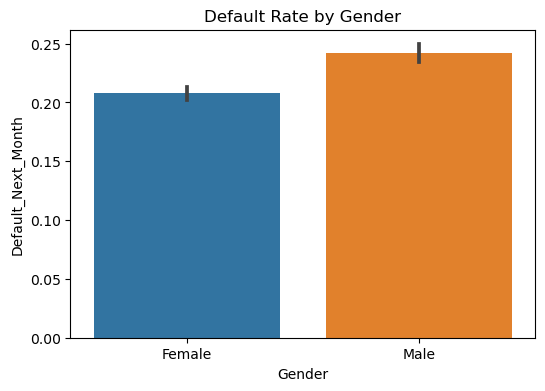
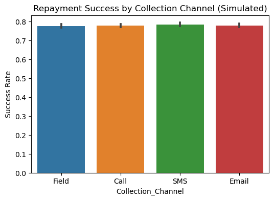
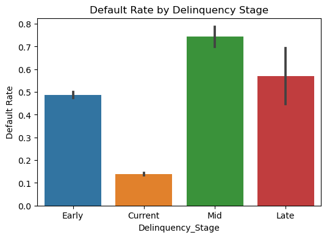
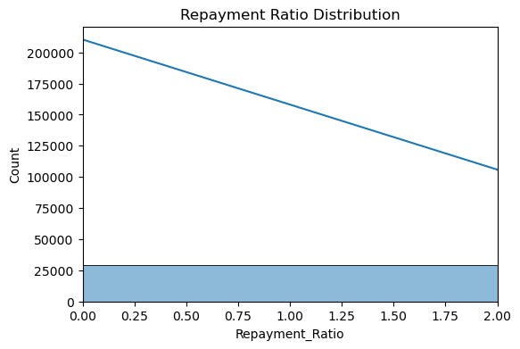

# 📊 Exploratory Data Analysis — Credit Risk & Collections Strategy

This report summarizes exploratory data analysis (EDA) performed on the **Default of Credit Card Clients (Taiwan, 2005)** dataset.  
The goal of this EDA is to understand repayment behavior, identify high-risk segments, and generate insights for building Tableau dashboards.

---

## 1. Default Rate by Gender

**Question:** Do males and females have different default rates?  
**Method:** Bar chart of default proportions by gender.  
**Insight:** Male clients show a slightly higher default rate (~24%) compared to female clients (~21%).  
**Decision:** Gender will be included as a segmentation filter in Tableau dashboards.

---

## 2. Repayment Success by Collection Channel (Simulated)

**Question:** Which communication channels are most effective for repayments?  
**Method:** Bar chart of repayment success rates by simulated channel assignment.  
**Insight:** All channels (Field, Call, SMS, Email) show similar repayment success (~78%), with small differences.  
**Decision:** Collection strategy dashboard will compare channel effectiveness to optimize resource allocation.

---

## 3. Default Rate by Delinquency Stage

**Question:** How does delinquency stage impact default probability?  
**Method:** Bar chart of default proportions across delinquency stages.  
**Insight:**  
- Current customers have the lowest default rate (~14%).  
- Mid-stage customers show the highest risk (~74%).  
- Late-stage also remains highly risky (~58%).  
**Decision:** A funnel/roll-rate chart in Tableau will illustrate stage progression and guide targeted interventions.

---

## 4. Repayment Ratio Distribution

**Question:** How do repayment amounts compare to billed amounts?  
**Method:** Histogram of `Repayment_Ratio` (capped at 2.0 for clarity).  
**Insight:** The distribution is heavily right-skewed — most customers repay less than 50% of billed amounts, with few outliers above 100%.  
**Decision:** Repayment ratios will be bucketed into repayment bands (0–25%, 25–75%, 75–100%, >100%) for clearer analysis in dashboards.

---

## ✅ Key EDA Takeaways
- Overall default rate ~22% (baseline KPI).  
- Males default slightly more often than females.  
- Delinquency stage strongly correlates with default risk (critical for roll-rate analysis).  
- Repayment ratios are highly skewed, requiring banding for meaningful insights.  
- Collection channel effectiveness is similar, but can be fine-tuned in strategy testing.

These findings shaped the **business requirements** and **dashboard mockups** documented in this project.
