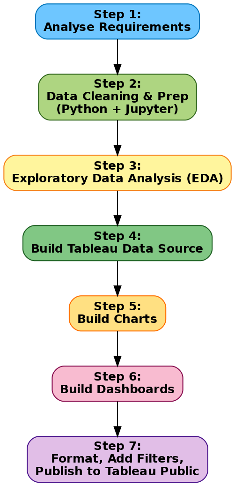

# 🔄 Tableau Project Process — Credit Risk & Collections Strategy

This project follows a structured 4-step process adapted from **Data with Baraa**'s Tableau methodology.  
Each step ensures clarity, consistency, and professional delivery.

---

## 📌 Step 1 — Analyse Requirements
- Collect requirements (business + data)
- Define **KPIs** (default rate, delinquency stages, repayment %, recovery)
- Choose right charts for each requirement
- Draw dashboard mockups
- Choose color scheme (Red = risk, Green = paid, Neutral = demographics)

---

## 📌 Step 2 — Build Data Source
- Connect dataset (Kaggle: Default of Credit Card Clients)
- Create data model (derive fields: delinquency stage, repayment ratio, A/B group)
- Rename fields & tables for clarity
- Check data types (numeric vs categorical)
- Understand and document data limitations

---

## 📌 Step 3 — Build Charts
- KPIs (BANS) → Total clients, Default %, Avg. delay, Avg. credit limit
- Trend chart → Delinquency over 6 months
- Funnel chart → Roll rates (Current → Early → Mid → Late)
- Bar charts → Default by demographics (Gender, Age, Education, Marriage)
- Scatter → Credit limit vs default probability
- A/B test line chart → Repayment success Control vs Test

---

## 📌 Step 4 — Build Dashboards
- Create container structure (Executive, Strategy, Customer dashboards)
- Place all charts into logical sections
- Apply formatting:
  - Distribute objects evenly
  - Format colors & sizes
  - Fit “Entire View”
  - Add legends and padding
- Add interactivity:
  - Filters (Age group, Education, Limit bands)
  - Drill-down options
- Add icons for demographics and KPIs
- Final polish: Consistent titles, tooltips, and branding

---

# 🔄 Tableau Project Process — Credit Risk & Collections Strategy

This project follows a structured 4-step process adapted from **Data with Baraa**'s Tableau methodology.  
Each step ensures clarity, consistency, and professional delivery.

---

## 📌 Step 1 — Analyse Requirements
- Collect requirements (business + data)
- Define **KPIs** (default rate, delinquency stages, repayment %, recovery)
- Choose right charts for each requirement
- Draw dashboard mockups
- Choose color scheme (Red = risk, Green = paid, Neutral = demographics)

---

## 📌 Step 2 — Build Data Source
- Connect dataset (Kaggle: Default of Credit Card Clients)
- Create data model (derive fields: delinquency stage, repayment ratio, A/B group)
- Rename fields & tables for clarity
- Check data types (numeric vs categorical)
- Understand and document data limitations

---

## 📌 Step 3 — Build Charts
- KPIs (BANS) → Total clients, Default %, Avg. delay, Avg. credit limit
- Trend chart → Delinquency over 6 months
- Funnel chart → Roll rates (Current → Early → Mid → Late)
- Bar charts → Default by demographics (Gender, Age, Education, Marriage)
- Scatter → Credit limit vs default probability
- A/B test line chart → Repayment success Control vs Test

---

## 📌 Step 4 — Build Dashboards
- Create container structure (Executive, Strategy, Customer dashboards)
- Place all charts into logical sections
- Apply formatting:
  - Distribute objects evenly
  - Format colors & sizes
  - Fit “Entire View”
  - Add legends and padding
- Add interactivity:
  - Filters (Age group, Education, Limit bands)
  - Drill-down options
- Add icons for demographics and KPIs
- Final polish: Consistent titles, tooltips, and branding

---

# 🔄 Tableau Project Process — Flowchart

---

## Process Overview
1. **Analyse Requirements** → Collect KPIs, choose charts, draw mockups, set colors  
2. **Build Data Source** → Connect data, clean fields, rename, check data types  
3. **Build Charts** → KPIs, funnels, trends, demographics, A/B test charts  
4. **Build Dashboards** → Assemble charts, format, add filters, publish  